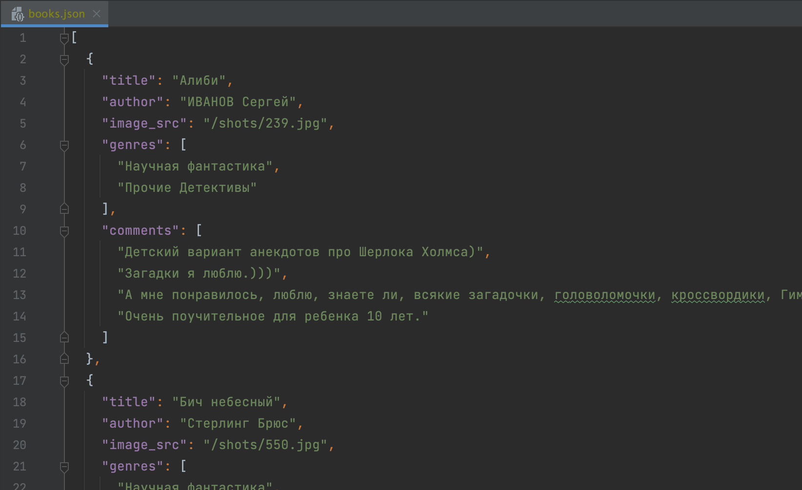

# parse_tululu_category.py

Программа на сайте [tululu.org](https://tululu.org) последовательно перебирает каждую страницу с книгами 
в жанре "Научная фантастика" в диапазоне, который задает пользователь. Затем для каждой найденной книги 
сохраняет изображения обложек в папку 'images/' и сами книги - в папку 'books/'.
Все файлы с книгами названы по названию самих книг и пронумерованы согласно страницам сайта.
Парсер, помимо поиска изображений, книг и названий, также собирает жанры, комментарии про книги и авторов 
в файл *books.json* для дальнейшего наращивания функционала программы.




## Как установить

Для этого проекта требуются следующие пакеты Python:

- requests >= 2.28.1
- lxml >= 4.9.2
- beautifulsoup4 >= 4.11.1
- pathvalidate >= 2.5.2
- tqdm >= 4.64.1

Эти зависимости можно установить с помощью следующей команды:

```Python
pip install -r requirements.txt
```


## Запуск с аргументами

Для запуска программы рекомендуется указать аргументы *start_page* и *end_page*, например:

```Python
python parse_tululu_category.py --start_page 1 --end_page 10 --skip_imgs
```

, где \
**--start_page** - номер страницы, с которой начнется скачивание книг, по умолчанию 1, \
**--end_page** - номер страницы, на которой закончится скачивание книг, по умолчанию 701, \
**--dest_folder** - Путь к каталогу с результатами парсинга, по умолчанию каталог, в котором запускается скрипт, \
**--skip_imgs** - флаг не скачивать картинки, по умолчанию false, \
**--skip_txt** - флаг не скачивать книги, по умолчанию false, \
**--json_path** - путь к *.json файлу с результатами, по умолчанию dest_folder.


## Цель проекта

Код написан в образовательных целях на онлайн-курсе для веб-разработчиков [dvmn.org](https://dvmn.org/).
